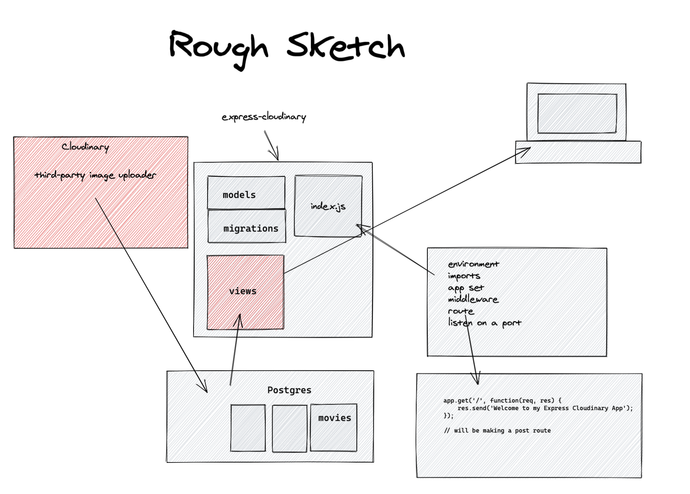

# express-cloudinary
Using Cloudinary, a cloud-based image and video management service for image uploads in my Express app.

## rough Sketch

## Input Image to POST Route

## Render View Page with Image

